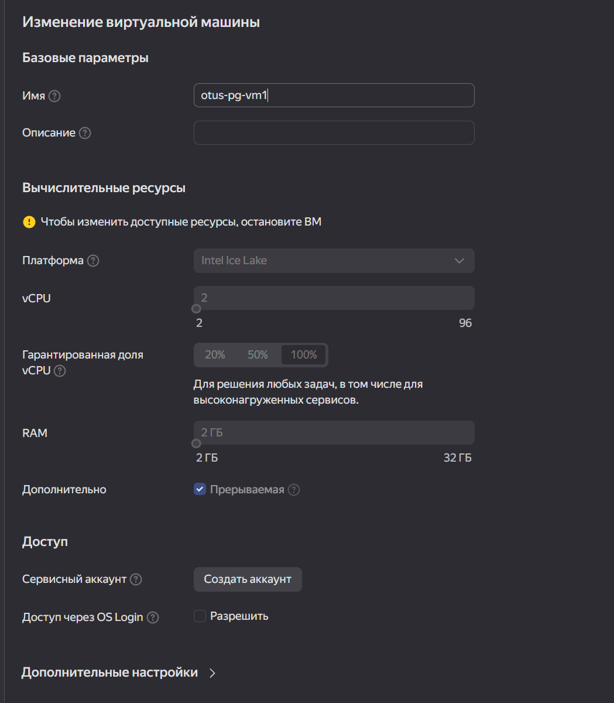

## Установка PostgreSQL
Домашнее задание 1 месяц 3 занятие

## Подключение к VM в облаке Yandex
https://yandex.cloud/en/docs/compute/operations/vm-connect/ssh#creating-ssh-keys

- Генерируем ключи на своей машине:
```bash
ssh-keygen -t ed25519
```
- Создаем VM в облаке, добавляем в ней сеть с подсетью и прописываем полученный выше публичный ключ для доступа:



- Указываем от какого пользователя будет вход
- Находим публичный IPv4 для VM
- Заходим в VM по ключу, где keypair ранее сгенерированный файл с приватным ключом:
```bash
ssh -i keypair esca@158.160.17.158
```
## Работа с CLI Yandex 
https://yandex.cloud/en/docs/cli/quickstart

- Установка Windows:
```bash
iex (New-Object System.Net.WebClient).DownloadString('https://storage.yandexcloud.net/yandexcloud-yc/install.ps1')
```
- Инициализация профиля:
```bash
yc init
```

### Полезные команды

- Посмотреть инстансы ` yc compute instances list`
- Посмотреть сети ` yc vpc network list`
- Посмотреть подсети ` yc vpc subnet list`
- Удаление VM и сетей `yc compute instance delete otus-pg-vm1 && yc vpc subnet delete otus-subnet && yc vpc network delete otus-pg-vm1-net`

## Работа с Docker
- Установка Docker с помощью скрипта. Use a convenience script. Only recommended for testing and development environments.:
```bash
 curl -fsSL https://get.docker.com -o get-docker.sh
 sudo sh get-docker.sh
 rm get-docker.sh && sudo usermod -aG docker $USER && newgrp docker
```
- Создаем Docker-сеть:
 ```bash
sudo docker network create pg-net
ae251ab960d49a0e5ff913f8b01a9e5b7d566aa0f6ade91cc52d129f1a62a540
- ```
- Создаем каталог /var/lib/postgres из /var/lib:
```bash
sudo mkdir posgtgres
```
- Добавляем и запускаем контейнер Postgres 15:
```bash
sudo docker run --name pg-server --network pg-net -e POSTGRES_PASSWORD=postgres -d -p 5432:5432 -v /var/lib/postgres:/var/lib/postgresql/data postgres:15

Status: Downloaded newer image for postgres:15
8435896bd0fbec8b4364c1421d7d9a43d807a66bf7bd030eb7eb4845347a0680
```
- Запускаем клиент Postgres и вводим пароль:
```bash
sudo docker run -it --rm --network pg-net --name pg-client postgres:15 psql -h pg-server -U postgres

postgres=# \conninfo
You are connected to database "postgres" as user "postgres" on host "pg-server" (address "172.18.0.2") at port "5432".
```
### Работа в Postgres клиенте
```postgresql
--- Создаем БД:
postgres=# create database otus;
CREATE DATABASE
--- Создаем таблицу:
postgres=# create table test (id int);
CREATE TABLE
--- Добавляем строки в таблицу:
postgres=# insert into test (id) values(1);
INSERT 0 1
postgres=# insert into test (id) values(2);
INSERT 0 1
--- Проверяем, что добавили:
postgres=# select * from test;
id
----
  1
  2
(2 rows)
```
## Подключение с домашнего PC
- Вызываем подключение по ip VM:
```bash
psql -p 5432 -U postgres -h 158.160.17.158 -d otus -W

```
- Проверяем БД:
```postgresql
otus=# \l
                                 List of databases
   Name    |  Owner   | Encoding |  Collate   |   Ctype    |   Access privileges
-----------+----------+----------+------------+------------+-----------------------
 otus      | postgres | UTF8     | en_US.utf8 | en_US.utf8 |
 postgres  | postgres | UTF8     | en_US.utf8 | en_US.utf8 |
 template0 | postgres | UTF8     | en_US.utf8 | en_US.utf8 | =c/postgres          +
           |          |          |            |            | postgres=CTc/postgres
 template1 | postgres | UTF8     | en_US.utf8 | en_US.utf8 | =c/postgres          +
           |          |          |            |            | postgres=CTc/postgres
(4 rows)

otus=# select * from test;
 id
----
  1
  2
(2 rows)

otus=#
```

## Повторная работа с Docker

- Смотрим контейнеры:
```bash
sudo docker ps -a

CONTAINER ID   IMAGE         COMMAND                  CREATED          STATUS          PORTS                                       NAMES
8435896bd0fb   postgres:15   "docker-entrypoint.s…"   14 minutes ago   Up 14 minutes   0.0.0.0:5432->5432/tcp, :::5432->5432/tcp   pg-server
```
- Останавливаем и удаляем контейнер:
```bash
docker stop 8435896bd0fb
docker rm 8435896bd0fb
```
- Ставим снова:
```bash
sudo docker run --name pg-server --network pg-net -e POSTGRES_PASSWORD=postgres -d -p 5432:5432 -v /var/lib/postgres:/var/lib/postgresql/data postgres:15
```
- Подключаемся клиентом Postgres и вводим пароль:
```bash
sudo docker run -it --rm --network pg-net --name pg-client postgres:15 psql -h pg-server -U postgres
```
- Проверяем, что БД осталась:
```bash
postgres=# \l
                                                List of databases
   Name    |  Owner   | Encoding |  Collate   |   Ctype    | ICU Locale | Locale Provider |   Access privileges
-----------+----------+----------+------------+------------+------------+-----------------+-----------------------
 otus      | postgres | UTF8     | en_US.utf8 | en_US.utf8 |            | libc            |
 postgres  | postgres | UTF8     | en_US.utf8 | en_US.utf8 |            | libc            |
 template0 | postgres | UTF8     | en_US.utf8 | en_US.utf8 |            | libc            | =c/postgres          +
           |          |          |            |            |            |                 | postgres=CTc/postgres
 template1 | postgres | UTF8     | en_US.utf8 | en_US.utf8 |            | libc            | =c/postgres          +
           |          |          |            |            |            |                 | postgres=CTc/postgres

postgres=# \c otus
You are now connected to database "otus" as user "postgres".
otus=# select * from test;
 id
----
  1
  2
(2 rows)
```