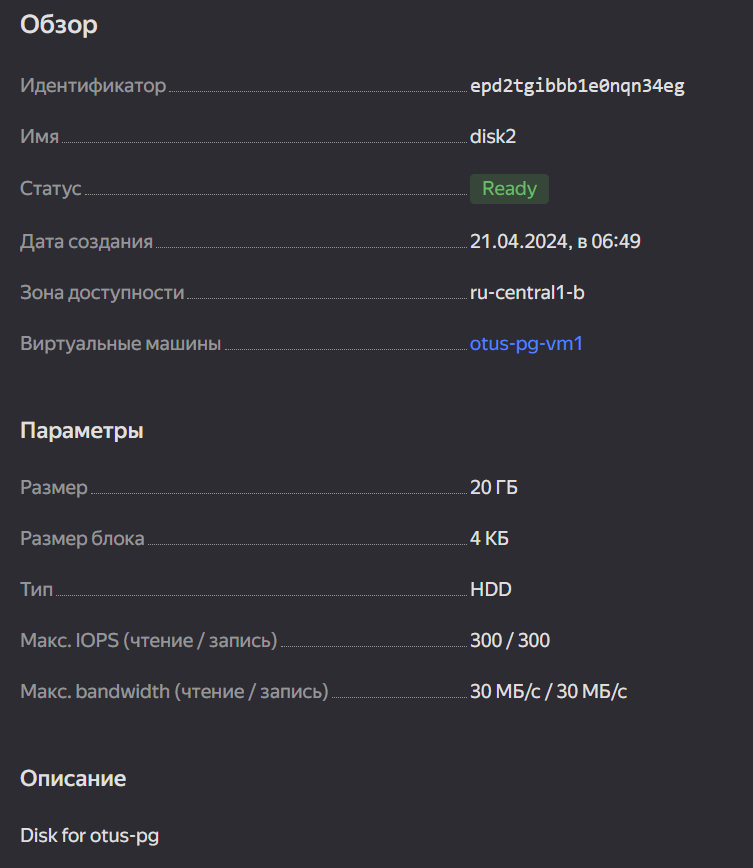

## Физический уровень PostgreSQL
Домашнее задание 1 месяц 6 занятие

### Установка PostgreSQL

- Подключаемся к VM
```bash
ssh -i keypair esca@84.252.140.7
```
- Добавляем репозиторий:
  `sudo sh -c 'echo "deb https://apt.postgresql.org/pub/repos/apt $(lsb_release -cs)-pgdg main" > /etc/apt/sources.list.d/pgdg.list'`
- Добавляем ключ:
  `wget --quiet -O - https://www.postgresql.org/media/keys/ACCC4CF8.asc | sudo apt-key add -`
- Обновляем пакеты:
  `sudo apt-get update`
- Устанавливаем 15 PostgreSQL:
  `sudo apt-get -y install postgresql-15`
- Проверяем версию:
  `psql --version`
```bash
psql (PostgreSQL) 15.6 (Ubuntu 15.6-1.pgdg22.04+1)
```
- Проверяем, что кластер запущен:
```bash
sudo -u postgres pg_lsclusters
Ver Cluster Port Status Owner    Data directory              Log file
15  main    5432 online postgres /var/lib/postgresql/15/main /var/log/postgresql/postgresql-15-main.log
```
### Работа с PostgreSQL
- Подключаемся:
```bash
sudo -u postgres psql
```
- Создаем БД:
```bash
create database otus;
```
- Создаем таблицу:
```bash
\c otus
create table test (c1 text);
```
- Добавляем строки:
```bash
otus=# insert into test values('1');
INSERT 0 1
otus=# insert into test values('2');
INSERT 0 1
```
- Проверяем:
```bash
otus=# select * from test;
 c1
----
 1
 2
(2 rows)
```
- Останавливаем кластер:
```bash
 sudo -u postgres pg_ctlcluster 15 main stop
 
 sudo -u postgres pg_lsclusters
Ver Cluster Port Status Owner    Data directory              Log file
15  main    5432 down   postgres /var/lib/postgresql/15/main /var/log/postgresql/postgresql-15-main.log
```
### Добавление диска
- Создаем новый диск в Yandex облаке и присоединяем его к VM:



- Проверяем, что появился в VM:
```bash
sudo lsblk -o NAME,FSTYPE,SIZE,MOUNTPOINT,LABEL

NAME   FSTYPE     SIZE MOUNTPOINT        LABEL
loop0  squashfs  63.3M /snap/core20/1822
loop1  squashfs  63.9M /snap/core20/2264
loop2  squashfs 111.9M /snap/lxd/24322
loop3  squashfs    87M /snap/lxd/27948
loop4  squashfs  49.8M /snap/snapd/18357
loop5  squashfs  39.1M /snap/snapd/21184
vda                20G
├─vda1              1M
└─vda2 ext4        20G /
vdb                20G
```
- Подключаем диск в VM

https://yandex.cloud/ru/docs/compute/operations/vm-control/vm-attach-disk#linux_2
```bash
sudo fdisk /dev/vdb

Welcome to fdisk (util-linux 2.37.2).
Changes will remain in memory only, until you decide to write them.
Be careful before using the write command.

Device does not contain a recognized partition table.
Created a new DOS disklabel with disk identifier 0xb7d0dcb1.

Command (m for help): n
Partition type
   p   primary (0 primary, 0 extended, 4 free)
   e   extended (container for logical partitions)
Select (default p): p
Partition number (1-4, default 1): 1
First sector (2048-41943039, default 2048):
Last sector, +/-sectors or +/-size{K,M,G,T,P} (2048-41943039, default 41943039):

Created a new partition 1 of type 'Linux' and of size 20 GiB.

Command (m for help): p
Disk /dev/vdb: 20 GiB, 21474836480 bytes, 41943040 sectors
Units: sectors of 1 * 512 = 512 bytes
Sector size (logical/physical): 512 bytes / 4096 bytes
I/O size (minimum/optimal): 4096 bytes / 4096 bytes
Disklabel type: dos
Disk identifier: 0xb7d0dcb1

Device     Boot Start      End  Sectors Size Id Type
/dev/vdb1        2048 41943039 41940992  20G 83 Linux

Command (m for help): w
The partition table has been altered.
Calling ioctl() to re-read partition table.
Syncing disks.
```
- Форматируем в ext4
```bash
sudo mkfs.ext4 /dev/vdb1

mke2fs 1.46.5 (30-Dec-2021)
Creating filesystem with 5242624 4k blocks and 1310720 inodes
Filesystem UUID: fc79b4f5-dbe2-47f1-8f30-9be34575c34a
```
- Посмотреть UUID дисков, наш vdb1:
```bash
sudo blkid
```
- Монтируем диск:
```bash
sudo mkdir /mnt/data && sudo mount /dev/vdb1 /mnt/data
```
- Автоматическое монтирование прописываем в /etc/fstab:
```bash
UUID=fc79b4f5-dbe2-47f1-8f30-9be34575c34a /mnt/data ext4 defaults 0 2
```
- Рестартим инстанс VM, диск остался примонтированным:
```bash
 df
Filesystem     1K-blocks    Used Available Use% Mounted on
tmpfs             200992    1160    199832   1% /run
/dev/vda2       20546752 6034268  13605152  31% /
tmpfs            1004940    1052   1003888   1% /dev/shm
tmpfs               5120       0      5120   0% /run/lock
/dev/vdb1       20465232      24  19400300   1% /mnt/data
tmpfs             200988       4    200984   1% /run/user/1000
```
## Перенос PostgreSQL
- Делаем пользователя postgres владельцем:
```bash
sudo chown -R postgres:postgres /mnt/data/
```
- Заходим под пользователем postgres, можно задать пароль для него:
```bash
su passwd postgres
su -u postgres
```
- Переносим каталог:
```bash
mv /var/lib/postgresql/15 /mnt/data
```
- Пробуем запустить кластер, не получилось, т.к. файлы перенесены:
```bash
sudo -u postgres pg_ctlcluster 15 main start

Error: /var/lib/postgresql/15/main is not accessible or does not exist
```
- Меняем файл настроек в /etc/postgresql/15/main postgresql.conf
```text
data_directory = '/var/lib/postgresql/15/main'          # use data in another directory
на
data_directory = '/mnt/data/15/main'          # use data in another directory
```
- Запускаем кластер:
```bash
sudo -u postgres pg_ctlcluster 15 main start
```
- Проверяем:
```bash
sudo -u postgres pg_lsclusters
Ver Cluster Port Status Owner    Data directory    Log file
15  main    5432 online postgres /mnt/data/15/main /var/log/postgresql/postgresql-15-main.log
```
- Заходим и проверяем данные в Postgres:
```bash
sudo -u postgres psql
psql (15.6 (Ubuntu 15.6-1.pgdg22.04+1))
Type "help" for help.

postgres=# \l
                                                 List of databases
   Name    |  Owner   | Encoding |   Collate   |    Ctype    | ICU Locale | Locale Provider |   Access privileges
-----------+----------+----------+-------------+-------------+------------+-----------------+-----------------------
 otus      | postgres | UTF8     | en_US.UTF-8 | en_US.UTF-8 |            | libc            |
 postgres  | postgres | UTF8     | en_US.UTF-8 | en_US.UTF-8 |            | libc            |
 template0 | postgres | UTF8     | en_US.UTF-8 | en_US.UTF-8 |            | libc            | =c/postgres          +
           |          |          |             |             |            |                 | postgres=CTc/postgres
 template1 | postgres | UTF8     | en_US.UTF-8 | en_US.UTF-8 |            | libc            | =c/postgres          +
           |          |          |             |             |            |                 | postgres=CTc/postgres
(4 rows)

postgres=# \c otus
You are now connected to database "otus" as user "postgres".
otus=# select * from test;
 c1
----
 1
 2
(2 rows)
```

