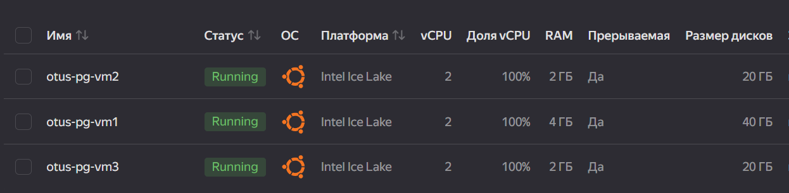

## Виды и устройство репликации в PostgreSQL. Практика применения.
Домашнее задание 2 месяц 13 занятие

### VM
- Создаем дополнительно еще 2 VM в облаке: выбираем Ubuntu, своя конфигурация, снимаем галку "Доступ через OS Login" и 
прописываем через логин и SSH-ключ, подсеть используем одинаковую для все трех VM.



### Установка PostgreSQL 15 на VM

- Подключаемся к VM
```bash
ssh -i keypair esca@84.252.140.7
```
- Добавляем репозиторий:
  `sudo sh -c 'echo "deb https://apt.postgresql.org/pub/repos/apt $(lsb_release -cs)-pgdg main" > /etc/apt/sources.list.d/pgdg.list' `
- Добавляем ключ:
  `wget --quiet -O - https://www.postgresql.org/media/keys/ACCC4CF8.asc | sudo apt-key add -`
- Обновляем пакеты:
  `sudo apt-get update`
- Устанавливаем 15 PostgreSQL:
  `sudo apt-get -y install postgresql-15`
- Проверяем версию:
  `psql --version`
```bash
psql (PostgreSQL) 15.6 (Ubuntu 15.6-1.pgdg22.04+1)
```
- Проверяем, что кластер запущен:
```bash
sudo -u postgres pg_lsclusters
Ver Cluster Port Status Owner    Data directory              Log file
15  main    5432 online postgres /var/lib/postgresql/15/main /var/log/postgresql/postgresql-15-main.log
```
- На новой машине не забываем задать пароли для postgres
```bash
В БД:
alter role postgres with password '123';

В Ubuntu:
sudo passwd postgres
```
- Меняем настройки для доступа с ip машин в VM1 и VM2 под пользователем postgres:
```bash
nano /etc/postgresql/15/main/postgresql.conf
listen_addresses = '*'

nano /etc/postgresql/15/main/pg_hba.conf
0.0.0.0/0
```
- Рестартим кластера для применения настроек
```bash
sudo pg_ctlcluster 15 main restart
```

### Работа с таблицами и логической репликацией

- Заходим в psqql
```bash
sudo -u postgres psql
```
- В VM1 создаем таблицы test1 и test2
```postgresql
postgres=# create table test1 (c1 text);
CREATE TABLE
postgres=# create table test2 (value integer);
CREATE TABLE
postgres=# \dt
List of relations
 Schema |       Name       | Type  |  Owner
--------+------------------+-------+----------
 public | pgbench_accounts | table | postgres
 public | pgbench_branches | table | postgres
 public | pgbench_history  | table | postgres
 public | pgbench_tellers  | table | postgres
 public | test1            | table | postgres
 public | test2            | table | postgres
(6 rows)
```
- В VM2 создаем таблицы test1 и test2
```postgresql
postgres=# create table test1 (c1 text);
CREATE TABLE
  postgres=# create table test2 (value integer);
CREATE TABLE
  postgres=# \dt
List of relations
 Schema | Name  | Type  |  Owner
--------+-------+-------+----------
 public | test1 | table | postgres
 public | test2 | table | postgres
(2 rows)
```
- Включаем логический уровень wal на VM1 и VM2
```postgresql
postgres=# alter system set wal_level = logical;
ALTER SYSTEM
```
- Рестартим кластера для применения настроек
```bash
sudo pg_ctlcluster 15 main restart
```
- Создаем публикацию на VM1 для test1
```postgresql
create publication test1_pub for table test1;
```
- Проверяем публикацию
```postgresql
postgres=# \dRp+
                           Publication test1_pub
  Owner   | All tables | Inserts | Updates | Deletes | Truncates | Via root
----------+------------+---------+---------+---------+-----------+----------
 postgres | f          | t       | t       | t       | t         | f
Tables:
    "public.test1"
```
- Создаем публикацию на VM2 для test2
```postgresql
postgres=# create publication test2_pub for table test2;
CREATE PUBLICATION
postgres=# \dRp+
Publication test2_pub
Owner   | All tables | Inserts | Updates | Deletes | Truncates | Via root
----------+------------+---------+---------+---------+-----------+----------
postgres | f          | t       | t       | t       | t         | f
Tables:
"public.test2"
```
- Подписываемся с VM1 на таблицу test2 VM2:
```postgresql
postgres=# create subscription test2_sub
  connection 'host=10.129.0.20 port=5432 user=postgres password=123'
  publication test2_pub with (copy_data = true);
NOTICE:  created replication slot "test2_sub" on publisher
CREATE SUBSCRIPTION

postgres=# \dRs
List of subscriptions
   Name    |  Owner   | Enabled | Publication
-----------+----------+---------+-------------
 test2_sub | postgres | t       | {test2_pub}
(1 row)
```
- Подписываемся с VM2 на таблицу test1 VM1:
```postgresql
postgres=# create subscription test1_sub
connection 'host=10.129.0.6 port=5432 user=postgres password=123'
publication test1_pub with (copy_data = true);
NOTICE:  created replication slot "test2_sub" on publisher
CREATE SUBSCRIPTION

postgres=# \dRs
List of subscriptions
   Name    |  Owner   | Enabled | Publication
-----------+----------+---------+-------------
 test1_sub | postgres | t       | {test1_pub}
(1 row)
```
#### Подписки VM3
- Заходим
```bash
sudo -u postgres psql
```
- Создаем таблицы
```postgresql
create table test1 (c1 text);
create table test2 (value integer);
```
- Создаем подписки с VM1 и VM2
```postgresql
create subscription test1_vm1_sub
  connection 'host=10.129.0.6 port=5432 user=postgres password=123'
  publication test1_pub with (copy_data = true);

create subscription test2_vm2_sub
  connection 'host=10.129.0.20 port=5432 user=postgres password=123'
  publication test2_pub with (copy_data = true);
```
- Проверяем подписки
```postgresql
postgres=# \dRs
              List of subscriptions
     Name      |  Owner   | Enabled | Publication
---------------+----------+---------+-------------
 test1_vm1_sub | postgres | t       | {test1_pub}
 test2_vm2_sub | postgres | t       | {test2_pub}
(2 rows)
```
### Проверка репликации
1. Добавляем строку в таблицу test1 на VM1
```postgresql
postgres=# insert into test1 values('go');
INSERT 0 1
```
2. Проверяем наличие в VM2 и VM3
```postgresql
postgres=# select * from test1;
 c1
----
 go
(1 row)
```
3. Добавляем строку в таблицу test2 на VM2
```postgresql
postgres=# insert into test2 values (100);
INSERT 0 1
```
4. Проверяем наличие на VM1 и VM3
```postgresql
postgres=# select * from test2;
 value
-------
   100
(1 row)
```


