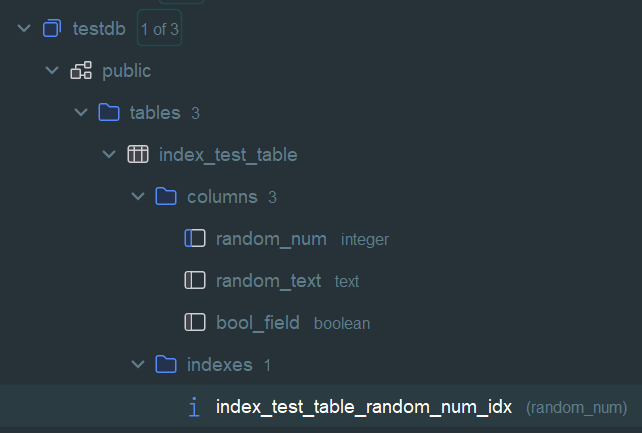
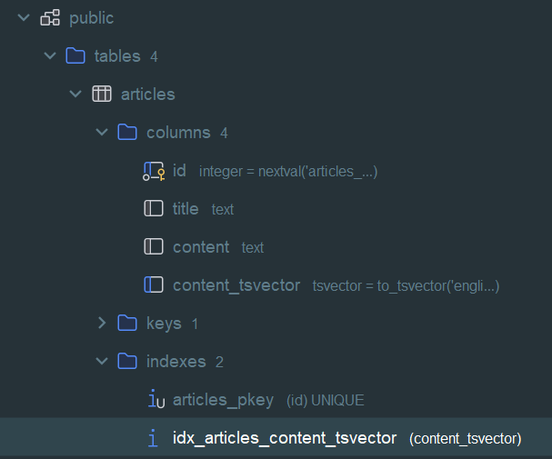
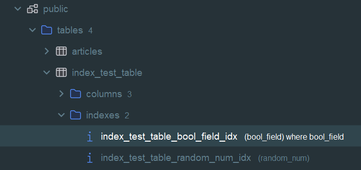

## Виды индексов. Работа с индексами и оптимизация запросов.
Домашнее задание 3 месяц 15 занятие

### Работа с БД
- Создаем удаленное подключение к Postgres в IDE Rider
```bash
jdbc:postgresql://158.160.2.221:5432/postgres -- строка подключения
```
### Обычный индекс по столбцу
- Создаем таблицу с 3 полями
```postgresql
CREATE TABLE index_test_table(random_num INTEGER, random_text TEXT, bool_field BOOLEAN);
```
- Заполняем таблицу 100000 строк
```postgresql
INSERT INTO index_test_table(random_num, random_text, bool_field) 
    SELECT s.id, chr((32 + random() * 94)::INTEGER), random() < 0.01 
    FROM generate_series(1, 100000) AS s(id) 
    ORDER BY random();
```
- Проверяем заполнение, часть вывода
```postgresql
select count(*), random_text from index_test_table 
group by random_text;
```
  | count | random\_text |
  | :--- | :--- |
  | 1047 | L |
  | 1085 | 8 |
  | 1108 | B |
  | 1095 | J |
  | 1081 | = |
- Создаем индекс по числовому столбцу - index_test_table_random_num_idx
```postgresql
CREATE INDEX ON index_test_table(random_num);
```


- Обновляем статистику, что бы заработал индекс
```postgresql
ANALYZE index_test_table;
```
- Смотрим план запроса с применением нового индекса по столбцу
```postgresql
EXPLAIN SELECT * FROM index_test_table WHERE random_num = 1047;
```
- Происходит сканирование индекса для поиска значения

  | QUERY PLAN |
  | :--- |
  | Index Scan using index\_test\_table\_random\_num\_idx on index\_test\_table  \(cost=0.29..8.31 rows=1 width=7\) |
  |   Index Cond: \(random\_num = 1047\) |

### Индекс для полнотекстового поиска
- Создаем таблицу
```postgresql
CREATE TABLE articles ( id SERIAL PRIMARY KEY, title TEXT, content TEXT );
```
- Заполняем
```postgresql
INSERT INTO articles (title, content) 
VALUES ('PostgreSQL Tutorial', 'This tutorial covers the basics of PostgreSQL.'), 
       ('Full-Text Search in PostgreSQL', 'Learn how to use full-text search in PostgreSQL.'), 
       ('Advanced PostgreSQL Features', 'Explore advanced features of PostgreSQL, including GIN indexes and full-text search.');
```
- Проверяем

  | id | title | content |
  | :--- | :--- | :--- |
  | 1 | PostgreSQL Tutorial | This tutorial covers the basics of PostgreSQL. |
  | 2 | Full-Text Search in PostgreSQL | Learn how to use full-text search in PostgreSQL. |
  | 3 | Advanced PostgreSQL Features | Explore advanced features of PostgreSQL, including GIN indexes and full-text search. |
- **tsvector** - это тип данных в PostgreSQL, предназначенный для полнотекстового поиска. Он представляет документ особым 
образом, который оптимизирован для поиска текста. Тип tsvector содержит лексемы (индексируемые единицы текста), которые 
являются нормализованными словами, полученными в результате обработки исходного текста. Эти лексемы могут быть созданы
из исходного текста с помощью парсинга, фильтрации стоп-слов и снижения слов к их основам (стемминг).
- Добавляем столбец с tsvector, на основе записанных в таблицу данных столбца content
```postgresql
ALTER TABLE articles ADD COLUMN content_tsvector TSVECTOR GENERATED ALWAYS AS (to_tsvector('english', content)) STORED;
```
- Проверяем

  | id | title | content | content\_tsvector |
  | :--- | :--- | :--- | :--- |
  | 1 | PostgreSQL Tutorial | This tutorial covers the basics of PostgreSQL. | 'basic':5 'cover':3 'postgresql':7 'tutori':2 |
  | 2 | Full-Text Search in PostgreSQL | Learn how to use full-text search in PostgreSQL. | 'full':6 'full-text':5 'learn':1 'postgresql':10 'search':8 'text':7 'use':4 |
  | 3 | Advanced PostgreSQL Features | Explore advanced features of PostgreSQL, including GIN indexes and full-text search. | 'advanc':2 'explor':1 'featur':3 'full':11 'full-text':10 'gin':7 'includ':6 'index':8 'postgresql':5 'search':13 'text':12 |
- **Gin** (Generalized Inverted Index — обобщенный инвертированный индекс) — это метод индексирования, доступный в 
PostgreSQL, который предназначен для обработки значений, в которых один элемент данных содержит несколько значений 
компонентов. Примеры таких данных включают массивы, документы JSONB или полнотекстовые поисковые индексы. Gin-индексы 
особенно эффективны для индексирования структур данных, во множество которых попадают несколько значений (например, 
ключевые слова). Они предоставляют быстрый поиск по таким структурам.
- Создаем Gin индекс по новому столбцу
```postgresql
CREATE INDEX idx_articles_content_tsvector ON articles USING gin (content_tsvector);
```


- **tsvector** можно использовать в сочетании с другим типом данных, **tsquery**, представляющим поисковый запрос текстового 
поиска. Для сопоставления tsvector и tsquery, PostgreSQL предоставляет специальный оператор @@. Такое сопоставление 
позволяет проверить, соответствует ли tsvector запросу, что полезно при выполнении поисковых запросов в базе данных.
- Пробуем вызывать план выполнения поиска
```postgresql
EXPLAIN SELECT title, content FROM articles WHERE content_tsvector @@ to_tsquery('english', 'PostgreSQL & full-text');
```
- Получаем последовательное сканирование без использования индекса, т.к. таблица маленькая и анализатор решил, что проще перебрать

  | QUERY PLAN |
  | :--- |
  | Seq Scan on articles  \(cost=0.00..1.04 rows=1 width=86\) |
  |   Filter: \(content\_tsvector @@ '''postgresql'' & ''full-text'' &lt;-&gt; ''full'' &lt;-&gt; ''text'''::tsquery\) |
- Что бы проверить индекс отключаем возможность последовательно сканирования и снова вызываем план
```postgresql
SET enable_seqscan = OFF;
```
- Получаем применение сканирование индекса

  | QUERY PLAN |
  | :--- |
  | Bitmap Heap Scan on articles  \(cost=20.01..24.02 rows=1 width=86\) |
  |   Recheck Cond: \(content\_tsvector @@ '''postgresql'' & ''full-text'' &lt;-&gt; ''full'' &lt;-&gt; ''text'''::tsquery\) |
  |   -&gt;  Bitmap Index Scan on idx\_articles\_content\_tsvector  \(cost=0.00..20.01 rows=1 width=0\) |
  |         Index Cond: \(content\_tsvector @@ '''postgresql'' & ''full-text'' &lt;-&gt; ''full'' &lt;-&gt; ''text'''::tsquery\) |

- Включили обратно возможность последовательного сканирования

### Индекс на части таблицы или индекс на поле с функцией
- Воспользуемся первой таблицей index_test_table
- Смотрим план выполнения по булевому столбцу - идет последовательное сканирование
```postgresql
EXPLAIN SELECT * FROM index_test_table WHERE bool_field;
```

  | QUERY PLAN |
  | :--- |
  | Seq Scan on index\_test\_table  \(cost=0.00..1443.00 rows=967 width=7\) |
  |   Filter: bool\_field |

- Создаем индекс с условием по этому столбцу - bool_field
```postgresql
CREATE INDEX ON index_test_table(bool_field) WHERE bool_field;
```



- Смотрим план выполнения снова для этого же запроса - сканирование индекса, cost стал 227.48, что существенно лучше 1443
```postgresql
EXPLAIN SELECT * FROM index_test_table WHERE bool_field;

Index Scan using index_test_table_bool_field_idx on index_test_table  (cost=0.15..227.48 rows=967 width=7)
```
### Составной индекс
- Воспользуемся первой таблицей index_test_table
- Смотрим план выполнения для запроса - применяется существующий индекс по 1 столбцу index_test_table_random_num_idx и
далее фильтр по тексту равному 'a' - cost 234.71
```postgresql
EXPLAIN SELECT * FROM index_test_table WHERE random_num <= 100 AND random_text = 'a';
```

  | QUERY PLAN |
  | :--- |
  | Bitmap Heap Scan on index\_test\_table  \(cost=5.00..234.71 rows=1 width=7\) |
  |   Recheck Cond: \(random\_num &lt;= 100\) |
  |   Filter: \(random\_text = 'a'::text\) |
  |   -&gt;  Bitmap Index Scan on index\_test\_table\_random\_num\_idx  \(cost=0.00..5.00 rows=94 width=0\) |
  |         Index Cond: \(random\_num &lt;= 100\) |

- Создаем составной индекс по двум столбцам, участвующим в запросе поиска
```postgresql
CREATE INDEX ON index_test_table(random_num, random_text);
```


- Снова смотрим план выполнения - уже используется сканирование по составному индексу
**index_test_table_random_num_random_text_idx** - cost стал 9.24, что гораздо лучше первого
  
  | QUERY PLAN |
  | :--- |
  | Index Scan using index\_test\_table\_random\_num\_random\_text\_idx on index\_test\_table  \(cost=0.29..9.24 rows=1 width=7\) |
  |   Index Cond: \(\(random\_num &lt;= 100\) AND \(random\_text = 'a'::text\)\) |

### Notes
- Удаление индексов
```postgresql
DROP INDEX IF EXISTS index_test_table_bool_field_idx
```
- Неиспользуемые индексы
```postgresql
SELECT s.schemaname, s.relname AS tablename, s.indexrelname AS indexname, pg_size_pretty(pg_relation_size(s.indexrelid)) AS index_size, s.idx_scan 
FROM pg_catalog.pg_stat_user_indexes s 
    JOIN pg_catalog.pg_index i ON s.indexrelid = i.indexrelid 
WHERE s.idx_scan < 10     -- has never been scanned
  AND 0 <>ALL (i.indkey)  -- no index column is an expression
  AND NOT i.indisunique   -- is not a UNIQUE index 
  AND NOT EXISTS          -- does not enforce a constraint 
 (SELECT 1 FROM pg_catalog.pg_constraint c 
           WHERE c.conindid = s.indexrelid) 
           ORDER BY pg_relation_size(s.indexrelid) DESC;
```