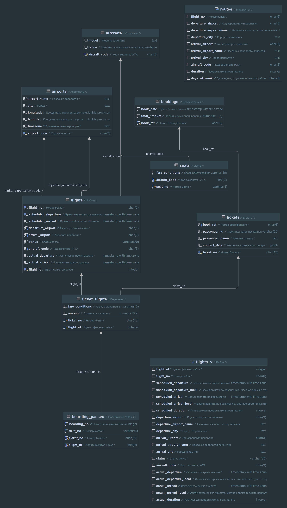
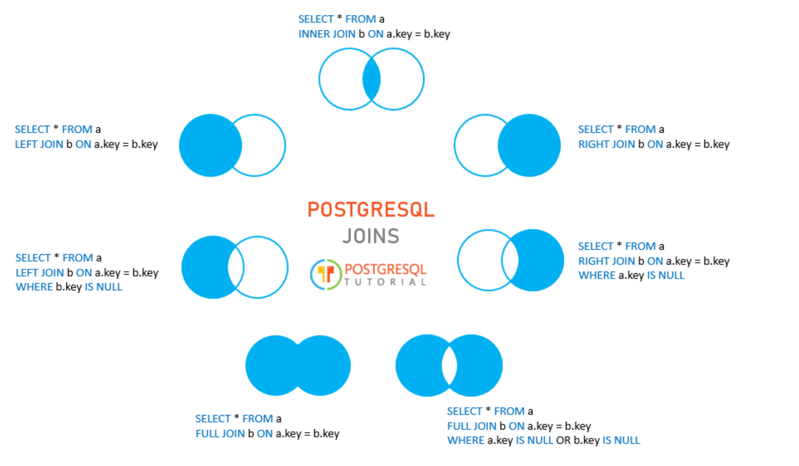

## Сбор и использование статистики (Join).
Домашнее задание 3 месяц 20 занятие

### Работа с БД
- Создаем удаленное подключение к Postgres в IDE Rider
```bash
jdbc:postgresql://158.160.18.118:5432/postgres -- строка подключения
```
- Подключаемся к VM
```bash
ssh -i keypair esca@158.160.18.118
```
- Устанавливаем БД полетов
```bash
sudo wget https://edu.postgrespro.ru/demo_small.zip && sudo apt install unzip && sudo unzip demo_small.zip && sudo -u postgres psql -d postgres -f /home/demo_small.sql -c 'alter database demo set search_path to bookings' 
```
- Схема БД
 


### Запросы

#### Виды соединений


#### Прямое соединение
- Запрос 
```postgresql
select a.aircraft_code, s.seat_no, s.fare_conditions from aircrafts a
join seats s on a.aircraft_code = s.aircraft_code
where a.model = 'Boeing 777-300'
order by s.fare_conditions;
```
- Пример вывода

  | aircraft\_code | seat\_no | fare\_conditions |
  | :--- | :--- | :--- |
  | 773 | 5H | Business |
  | 773 | 5K | Business |
  | 773 | 3A | Business |
  | 773 | 3C | Business |

- План выполнения
```postgresql
+---------------------------------------------------------------------------------------------------------------------------------+
|QUERY PLAN                                                                                                                       |
+---------------------------------------------------------------------------------------------------------------------------------+
|Sort  (cost=23.28..23.65 rows=149 width=15) (actual time=0.195..0.212 rows=402 loops=1)                                          |
|  Sort Key: s.fare_conditions                                                                                                    |
|  Sort Method: quicksort  Memory: 46kB                                                                                           |
|  ->  Nested Loop  (cost=5.43..17.90 rows=149 width=15) (actual time=0.052..0.121 rows=402 loops=1)                              |
|        ->  Seq Scan on aircrafts a  (cost=0.00..1.11 rows=1 width=4) (actual time=0.005..0.006 rows=1 loops=1)                  |
|              Filter: (model = 'Boeing 777-300'::text)                                                                           |
|              Rows Removed by Filter: 8                                                                                          |
|        ->  Bitmap Heap Scan on seats s  (cost=5.43..15.29 rows=149 width=15) (actual time=0.045..0.075 rows=402 loops=1)        |
|              Recheck Cond: (aircraft_code = a.aircraft_code)                                                                    |
|              Heap Blocks: exact=4                                                                                               |
|              ->  Bitmap Index Scan on seats_pkey  (cost=0.00..5.39 rows=149 width=0) (actual time=0.028..0.028 rows=402 loops=1)|
|                    Index Cond: (aircraft_code = a.aircraft_code)                                                                |
|Planning Time: 0.280 ms                                                                                                          |
|Execution Time: 0.241 ms                                                                                                         |
+---------------------------------------------------------------------------------------------------------------------------------+
```
- Комментарий: все места для самолета Boeing 777-300, отсортированные по типу места

#### Левостороннее соединение
- Запрос
```postgresql
select t.ticket_no, b.book_date, b.total_amount
from tickets t
left join bookings b on t.book_ref = b.book_ref
where passenger_name = 'ADELINA BELYAEVA';
```
- Пример вывода

  | ticket\_no | book\_date | total\_amount |
  | :--- | :--- | :--- |
  | 0005432186838 | 2016-09-03 20:46:00.000000 +00:00 | 82300.00 |
  | 0005433341673 | 2016-08-28 16:24:00.000000 +00:00 | 56600.00 |

- План выполнения
```postgresql
+-------------------------------------------------------------------------------------------------------------------------------------+
|QUERY PLAN                                                                                                                           |
+-------------------------------------------------------------------------------------------------------------------------------------+
|Gather  (cost=1000.42..9175.53 rows=33 width=28) (actual time=2.668..38.881 rows=2 loops=1)                                          |
|  Workers Planned: 2                                                                                                                 |
|  Workers Launched: 2                                                                                                                |
|  ->  Nested Loop Left Join  (cost=0.42..8172.23 rows=14 width=28) (actual time=17.680..28.549 rows=1 loops=3)                       |
|        ->  Parallel Seq Scan on tickets t  (cost=0.00..8054.07 rows=14 width=21) (actual time=17.673..28.535 rows=1 loops=3)        |
|              Filter: (passenger_name = 'ADELINA BELYAEVA'::text)                                                                    |
|              Rows Removed by Filter: 122244                                                                                         |
|        ->  Index Scan using bookings_pkey on bookings b  (cost=0.42..8.44 rows=1 width=21) (actual time=0.015..0.015 rows=1 loops=2)|
|              Index Cond: (book_ref = t.book_ref)                                                                                    |
|Planning Time: 0.178 ms                                                                                                              |
|Execution Time: 38.904 ms                                                                                                            |
+-------------------------------------------------------------------------------------------------------------------------------------+
```
- Комментарий: по чем и когда забронировала билеты ADELINA BELYAEVA
#### Кросс соединение
- Запрос
```postgresql
select model, range, airport_code
from aircrafts a
cross join airports p
where airport_name = 'Мирный';
```
- Пример вывода

  | model | range | airport\_code |
  | :--- | :--- | :--- |
  | Boeing 777-300 | 11100 | MJZ |
  | Boeing 767-300 | 7900 | MJZ |
  | Sukhoi SuperJet-100 | 3000 | MJZ |
  | Airbus A320-200 | 5700 | MJZ |
  | Airbus A321-200 | 5600 | MJZ |
  | Airbus A319-100 | 6700 | MJZ |
  | Boeing 737-300 | 4200 | MJZ |
  | Cessna 208 Caravan | 1200 | MJZ |
  | Bombardier CRJ-200 | 2700 | MJZ |

- План выполнения
```postgresql
+----------------------------------------------------------------------------------------------------------+
|QUERY PLAN                                                                                                |
+----------------------------------------------------------------------------------------------------------+
|Nested Loop  (cost=0.00..4.48 rows=9 width=24) (actual time=0.013..0.023 rows=9 loops=1)                  |
|  ->  Seq Scan on airports p  (cost=0.00..3.30 rows=1 width=4) (actual time=0.010..0.018 rows=1 loops=1)  |
|        Filter: (airport_name = 'Мирный'::text)                                                           |
|        Rows Removed by Filter: 103                                                                       |
|  ->  Seq Scan on aircrafts a  (cost=0.00..1.09 rows=9 width=20) (actual time=0.002..0.003 rows=9 loops=1)|
|Planning Time: 0.061 ms                                                                                   |
|Execution Time: 0.038 ms                                                                                  |
+----------------------------------------------------------------------------------------------------------+

```
- Комментарий: какие самолеты могут полететь в Мирный (без учета дальности полета)

#### Полное соединение
- Запрос
```postgresql
select tf.flight_id, f.flight_no, f.scheduled_departure, f.scheduled_arrival
from ticket_flights tf
full join flights f on tf.flight_id = f.flight_id;
-- where tf.flight_id is null and flight_no = 'PG0055';
```
- Пример вывода

  | flight\_id | flight\_no | scheduled\_departure | scheduled\_arrival |
  | :--- | :--- | :--- | :--- |
  | 30625 | PG0013 | 2016-09-13 14:15:00.000000 +00:00 | 2016-09-13 16:00:00.000000 +00:00 |
  | 30625 | PG0013 | 2016-09-13 14:15:00.000000 +00:00 | 2016-09-13 16:00:00.000000 +00:00 |
  | 30625 | PG0013 | 2016-09-13 14:15:00.000000 +00:00 | 2016-09-13 16:00:00.000000 +00:00 |
  | 30625 | PG0013 | 2016-09-13 14:15:00.000000 +00:00 | 2016-09-13 16:00:00.000000 +00:00 |

- План выполнения
```postgresql
+--------------------------------------------------------------------------------------------------------------------------------+
|QUERY PLAN                                                                                                                      |
+--------------------------------------------------------------------------------------------------------------------------------+
|Hash Full Join  (cost=1137.22..23054.87 rows=1045726 width=27) (actual time=8.288..246.715 rows=1056621 loops=1)                |
|  Hash Cond: (tf.flight_id = f.flight_id)                                                                                       |
|  ->  Seq Scan on ticket_flights tf  (cost=0.00..19172.26 rows=1045726 width=4) (actual time=0.006..56.833 rows=1045726 loops=1)|
|  ->  Hash  (cost=723.21..723.21 rows=33121 width=27) (actual time=8.231..8.233 rows=33121 loops=1)                             |
|        Buckets: 65536  Batches: 1  Memory Usage: 2453kB                                                                        |
|        ->  Seq Scan on flights f  (cost=0.00..723.21 rows=33121 width=27) (actual time=0.007..3.991 rows=33121 loops=1)        |
|Planning Time: 0.083 ms                                                                                                         |
|Execution Time: 276.357 ms                                                                                                      |
+--------------------------------------------------------------------------------------------------------------------------------+

```
- Комментарий: можно посмотреть пересечение билетов и вылетов, если применять фильтры
#### Разные типы соединений
- Запрос
```postgresql
select flight_no, passenger_name, bp.seat_no, f.departure_airport, f.arrival_airport
from flights f
join ticket_flights tf on f.flight_id = tf.flight_id
left join boarding_passes bp on bp.ticket_no = tf.ticket_no and bp.flight_id = tf.flight_id
left join tickets t on t.ticket_no = tf.ticket_no
where f.flight_no = 'PG0674' 
  and f.scheduled_arrival > to_date('20160914', 'yyyymmdd')
  and f.scheduled_arrival < to_date('20160915', 'yyyymmdd')
order by passenger_name;
```
- Пример вывода

  | flight\_no | passenger\_name | seat\_no | departure\_airport | arrival\_airport |
  | :--- | :--- | :--- | :--- | :--- |
  | PG0674 | ALEKSANDR ZHUKOV | 1A | KRO | KJA |
  | PG0674 | ALEKSANDR ZHUKOV | 5A | KRO | KJA |
  | PG0674 | ALEKSEY IVANOV | 4C | KRO | KJA |
  | PG0674 | ALEKSEY POPOV | 19B | KRO | KJA |
  | PG0674 | ALLA PETROVA | 5C | KRO | KJA |
  | PG0674 | ANATOLIY EGOROV | 20C | KRO | KJA |
  | PG0674 | ANDREY KRASNOV | 7C | KRO | KJA |
  | PG0674 | ANDREY KUZNECOV | 22C | KRO | KJA |
  | PG0674 | ANDREY MEDVEDEV | 22D | KRO | KJA |

- План выполнения
```postgresql
+---------------------------------------------------------------------------------------------------------------------------------------------------------------------------------------+
|QUERY PLAN                                                                                                                                                                             |
+---------------------------------------------------------------------------------------------------------------------------------------------------------------------------------------+
|Gather Merge  (cost=15360.98..15364.01 rows=26 width=34) (actual time=147.251..149.242 rows=43 loops=1)                                                                                |
|  Workers Planned: 2                                                                                                                                                                   |
|  Workers Launched: 2                                                                                                                                                                  |
|  ->  Sort  (cost=14360.95..14360.99 rows=13 width=34) (actual time=138.575..138.580 rows=14 loops=3)                                                                                  |
|        Sort Key: t.passenger_name                                                                                                                                                     |
|        Sort Method: quicksort  Memory: 28kB                                                                                                                                           |
|        Worker 0:  Sort Method: quicksort  Memory: 25kB                                                                                                                                |
|        Worker 1:  Sort Method: quicksort  Memory: 25kB                                                                                                                                |
|        ->  Nested Loop Left Join  (cost=133.23..14360.71 rows=13 width=34) (actual time=91.771..138.533 rows=14 loops=3)                                                              |
|              ->  Nested Loop Left Join  (cost=132.80..14354.62 rows=13 width=32) (actual time=91.765..138.389 rows=14 loops=3)                                                        |
|                    ->  Hash Join  (cost=132.38..14348.48 rows=13 width=33) (actual time=91.756..138.244 rows=14 loops=3)                                                              |
|                          Hash Cond: (tf.flight_id = f.flight_id)                                                                                                                      |
|                          ->  Parallel Seq Scan on ticket_flights tf  (cost=0.00..13072.19 rows=435719 width=18) (actual time=0.007..52.190 rows=348575 loops=3)                       |
|                          ->  Hash  (cost=132.37..132.37 rows=1 width=19) (actual time=0.163..0.165 rows=1 loops=3)                                                                    |
|                                Buckets: 1024  Batches: 1  Memory Usage: 9kB                                                                                                           |
|                                ->  Bitmap Heap Scan on flights f  (cost=4.62..132.37 rows=1 width=19) (actual time=0.086..0.160 rows=1 loops=3)                                       |
|                                      Recheck Cond: (flight_no = 'PG0674'::bpchar)                                                                                                     |
|                                      Filter: ((scheduled_arrival > to_date('20160914'::text, 'yyyymmdd'::text)) AND (scheduled_arrival < to_date('20160915'::text, 'yyyymmdd'::text)))|
|                                      Rows Removed by Filter: 60                                                                                                                       |
|                                      Heap Blocks: exact=2                                                                                                                             |
|                                      ->  Bitmap Index Scan on flights_flight_no_scheduled_departure_key  (cost=0.00..4.62 rows=44 width=0) (actual time=0.036..0.036 rows=61 loops=3) |
|                                            Index Cond: (flight_no = 'PG0674'::bpchar)                                                                                                 |
|                    ->  Index Scan using boarding_passes_pkey on boarding_passes bp  (cost=0.42..0.47 rows=1 width=21) (actual time=0.009..0.009 rows=1 loops=43)                      |
|                          Index Cond: ((ticket_no = tf.ticket_no) AND (flight_id = tf.flight_id))                                                                                      |
|              ->  Index Scan using tickets_pkey on tickets t  (cost=0.42..0.47 rows=1 width=30) (actual time=0.009..0.009 rows=1 loops=43)                                             |
|                    Index Cond: (ticket_no = tf.ticket_no)                                                                                                                             |
|Planning Time: 0.654 ms                                                                                                                                                                |
|Execution Time: 149.286 ms                                                                                                                                                             |
+---------------------------------------------------------------------------------------------------------------------------------------------------------------------------------------+
```
- Комментарий: перелет рейсом PG0674 за 14.09.2016 число с именами пассажиров и их мест
