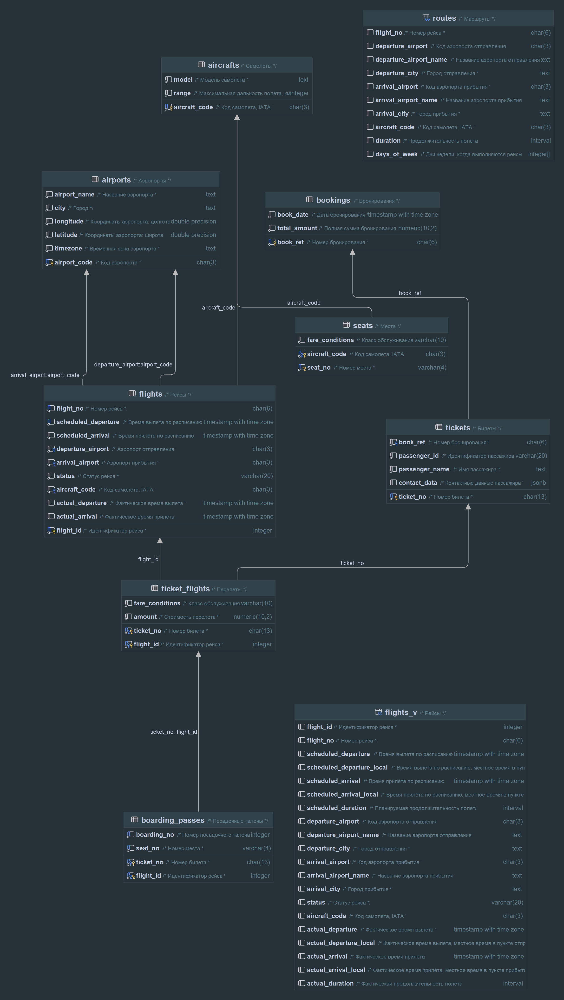
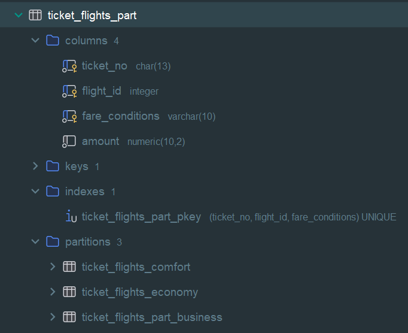

## Секционирование.
Домашнее задание 3 месяц 21 занятие

### Работа с БД
- Создаем удаленное подключение к Postgres в IDE Rider
```bash
jdbc:postgresql://158.160.71.148:5432/postgres -- строка подключения
```
- Подключаемся к VM
```bash
ssh -i keypair esca@158.160.71.148
```
- Загружаем demo версию БД medium из каталога home
```bash
sudo wget https://edu.postgrespro.ru/demo_medium.zip && sudo apt install unzip && sudo unzip demo_medium.zip && sudo -u postgres psql -d postgres -f /home/demo_medium.sql -c 'alter database demo set search_path to bookings' 
```
### Секционирование
- Размеры таблиц
```postgresql
SELECT
    relname AS "Table",
    pg_size_pretty(pg_relation_size(relid)) AS "Size"
FROM
    pg_catalog.pg_statio_user_tables
ORDER BY
    pg_relation_size(relid) DESC;
```
| Table | Size |
| :--- | :--- |
| ticket\_flights | 154 MB |
| boarding\_passes | 109 MB |
| tickets | 109 MB |
| bookings | 30 MB |
| flights | 6336 kB |
| routes | 136 kB |
| seats | 64 kB |
| airports | 16 kB |
| aircrafts | 8192 bytes |

- Всего строк
```postgresql
select count(1) from ticket_flights;
2360335
```
- Схема БД



#### Секционирование по списку значений (by list) - таблица ticket_flights 
- Будем секционировать по типу салона
```postgresql
create table ticket_flights_part (like ticket_flights)
partition by list (fare_conditions);
-- Добавляем только первичный ключ, для примера:
alter table bookings.ticket_flights_part
    add primary key (ticket_no, flight_id, fare_conditions); -- fare_conditions теперь должно участвовать
```
- Данные в таблице по типу салона

| count | fare\_conditions |
| :--- | :--- |
| 242204 | Business |
| 39154 | Comfort |
| 2078977 | Economy |

- **Проблемы**: столбец по которому партицируют должен теперь участвовать во всех ограничениях таблицы
иначе получаем ошибку: ERROR: unique constraint on partitioned table must include all partitioning columns. Но тогда
не понятно как изначальное ограничение будет работать на всю таблицу - получается, что в разных партициях
могут быть одинаковые значения по изначальному ограничению, например, было ограничение ticket_no, flight_id
теперь же нужно добавить fare_conditions, получается что теперь могут быть одинаковые ключи ticket_no, flight_id в разных партициях.
- Создаем партиции
```postgresql
CREATE TABLE ticket_flights_part_business PARTITION OF ticket_flights_part FOR VALUES IN ('Business');
CREATE TABLE ticket_flights_comfort PARTITION OF ticket_flights_part FOR VALUES IN ('Comfort');
CREATE TABLE ticket_flights_economy PARTITION OF ticket_flights_part FOR VALUES IN ('Economy');
```
- Переливаем данные из исходной таблицы
```postgresql
INSERT INTO ticket_flights_part SELECT * FROM ticket_flights;
```
- Распределение по размерам партиций и исходной таблицы (не стер в имени business - part)

| Table | Size |
| :--- | :--- |
| ticket\_flights | 154 MB |
| ticket\_flights\_comfort | 2616 kB |
| ticket\_flights\_economy | 135 MB |
| ticket\_flights\_part\_business | 16 MB |
- Сравнение планов выполнения между партицированной таблицей и нет
```postgresql
explain analyse 
select * from ticket_flights_part where fare_conditions = 'Business';
```
| QUERY PLAN |
| :--- |
| Seq Scan on ticket\_flights\_part\_business ticket\_flights\_part  \(cost=0.00..5046.55 rows=242204 width=33\) \(actual time=0.007..24.368 rows=242204 loops=1\) |
|   Filter: \(\(fare\_conditions\)::text = 'Business'::text\) |
| Planning Time: 0.086 ms |
| Execution Time: 30.955 ms |
```postgresql
explain analyse
select * from ticket_flights where fare_conditions = 'Business';
```
| QUERY PLAN |
| :--- |
| Seq Scan on ticket\_flights  \(cost=0.00..49174.19 rows=248307 width=32\) \(actual time=0.008..155.535 rows=242204 loops=1\) |
|   Filter: \(\(fare\_conditions\)::text = 'Business'::text\) |
|   Rows Removed by Filter: 2118131 |
| Planning Time: 0.046 ms |
| Execution Time: 161.873 ms |
- Полная схема партицированной таблицы



- Для использования партицированной таблицы вместо исходной:
  1. Исходную переименовываем в _old
  2. Партицированную переименовываем в исходную
  3. Накладываем и пересоздаем оставшиеся индексы и ограничения
  4. Дропаем старую таблицу

### Notes
- Зависшие сессии
```postgresql
SELECT pid, usename, datname, state, query_start, query art, query
FROM pg_stat_activity
WHERE datname = 'demo';
```
- Остановить процесс
```postgresql
SELECT pg_terminate_backend(pid);
```